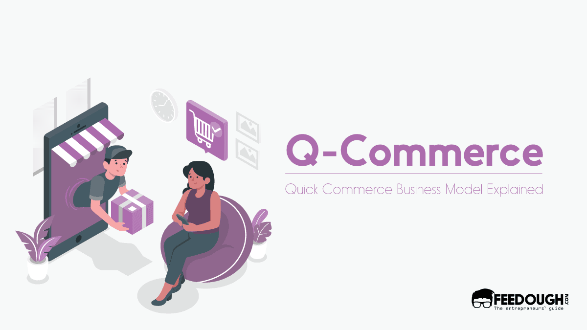
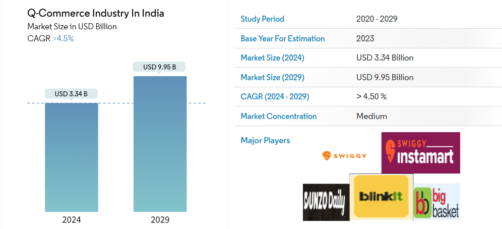
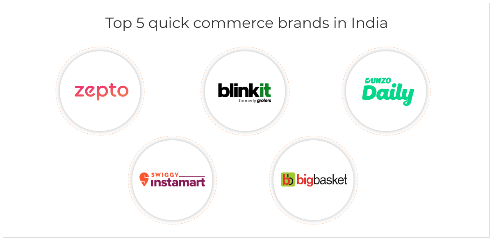
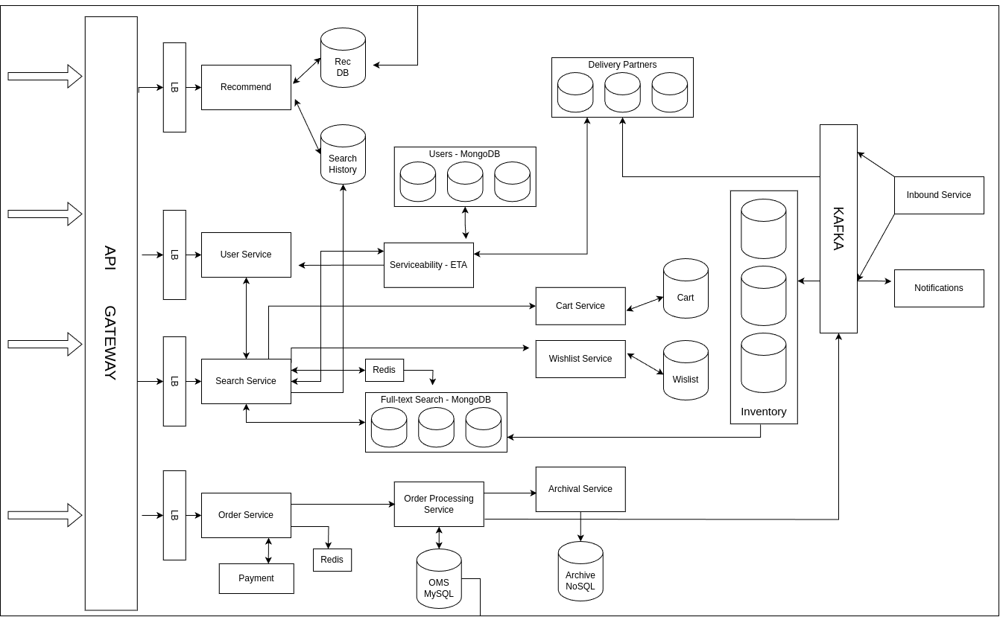

# Portfolio on Q-Commerce Applications: Exploring System Design, Principles, Data Structures, and Algorithms in Blinkit

This is a project for the course Algorithmic Problem Solving, introduced by Mr. Prakash Hegade at the School of Computer Science and Engineering (SOCSE), KLE Technological University, Hubli.

## Goals of the Portfolio

- **Exploring Design Principles:** Investigate design principles used in robust, scalable solutions.
- **Advanced Data Structures and Algorithms:** Study advanced data structures and algorithms employed in robust systems.
- **Optimization and Reliability:** Understand the integration of these elements to optimize performance and ensure reliability in Quick Commerce applications.

## Introduction to Q-Commerce

Getting products delivered within an hour of ordering was a far-fetched dream a few years ago. But this concept is now becoming part of our reality with companies like Blinkit, Swiggy Instamart, etc., introducing their own quick delivery services. This quick delivery has disrupted the existing market and created a new industry domain for itself – Q-Commerce.

## How is it Different from E-Commerce?

Q-Commerce or quick commerce is an e-commerce business model driven by quick on-demand delivery; that is, the business tends to deliver the ordered items within an hour of placing the order.

The quick commerce business model combines the benefits of e-commerce (conducting trade using the internet) and the traditional shopping experience (completing trade within minutes) to create a new business model that satisfies the increasing demands for speed while buying online.

## Market Analysis

The Q-Commerce Industry In India Market size is estimated at USD 3.34 billion in 2024, and is expected to reach USD 9.95 billion by 2029, growing at a CAGR of greater than 4.5% during the forecast period (2024-2029).

In India, the quick commerce market is witnessing a significant growth rate because it provides consumers faster shopping experience than any other e-commerce platform. The reason for the increased adoption of quick commerce platforms is because of the fast and convenient delivery service. The rising urbanization and the trend of online shopping also contribute to the growth of the quick commerce industry in India.

Quick commerce is one of the fastest-growing e-commerce platforms that enhances convenience through the fast delivery of products. The factor that attracts customers to the instant delivery platform is the delivery of products to doorsteps within 10-30 minutes.

The Indian quick commerce market is competitive. Consumers are increasingly shifting toward quick commerce because of factors such as fast delivery, price, discounts & offers, wide product assortment, availability, and ease of payment. 

The major players in the market include Swiggy Instamart, Blinkit, Dunzo, Big Basket, and Zepto. These players hold more than 80% market share.
This portfolio focuses on high-level system design, data structures, and algorithms for the Blinkit application.

## Objective

Design a high-level system architecture, identify, and discuss relevant data structures and algorithms used to create robust and scalable solutions.

## Scope of the Project
The project scope does not include payment processing, and our focus does not extend to low-level design or database schema.

### System Design

#### Functional Requirements

- **Search Functionality:** Should provide a search functionality with delivery ETA.
- **Product Catalog:** Should provide a catalog of all products.
- **Cart and Wishlist Features:** Should provide Cart and Wishlist features.
- **Order Processing:** Should handle order processing smoothly.
- **Order History:** Should provide a view for all previous orders.

#### Non-Functional Requirements

- **Scalability**
- **Availability**
- **Consistency**

Inventory is managed by a main NoSQL cluster that holds item details, with updates from vendors coming through Kafka. Various services may need to interact with vendors, collectively referred to as "Inbound Services."

The search service is crucial for efficient operation as it interacts with multiple services and data stores. It provides users with a list of items based on their search using full-text search, which can be implemented with Elastic Search or MongoDB's version. The search results are cached in Redis for quick retrieval later. We will also discuss the feature of search auto-complete in a later part of this portfolio.

The search service invokes the Serviceability and ETA service to determine if the user's location is serviceable. This service uses a database of users and delivery partners, utilizing their “latitude” and “longitude” for location-based filtering. These databases are partitioned using geo-spatial indexing for efficient filtering. Delivery partner locations are continuously updated through Kafka.

Users are also shown recommendations based on their cart, wishlist, and order history. The orders service caches orders in Redis and stores them in a MySQL database for ACID properties. Payment processing is handled by the "Payment" service, which returns the status of the payment. If successful, the transaction is updated in the MySQL database, a notification is sent to the user via Kafka, and necessary updates are made in the inventory database. The order is then archived in a NoSQL database instead of maintaining all orders in a MySQL cluster.

# Concepts Discussed in Q-Commerce Application Portfolio

This portfolio focuses on discussing various algorithms and data structures relevant to the Blinkit application.

## Concepts Covered

- **Indexing with B+ Trees**
- **Auto-complete suggestions for search with Trie**
- **Path finding with A* Search**
- **Max Flow Problem**
- **Skip Lists**
- **Hash Tables**
- **Full text search - Inverted Indexing**
- **Range based queries - Segment Trees**
- **Load balancer - Least Response Time Algorithm**
- **Assignment Problem**
- **Dijkstra’s Algorithm**
- **Disjoint Set**
- **Girvan Newman Algorithm**
- **Hashmaps**
- **Content Filtering Algorithm**

