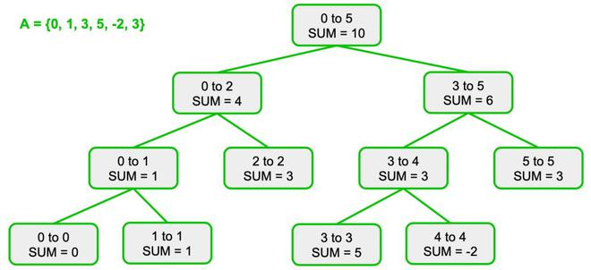
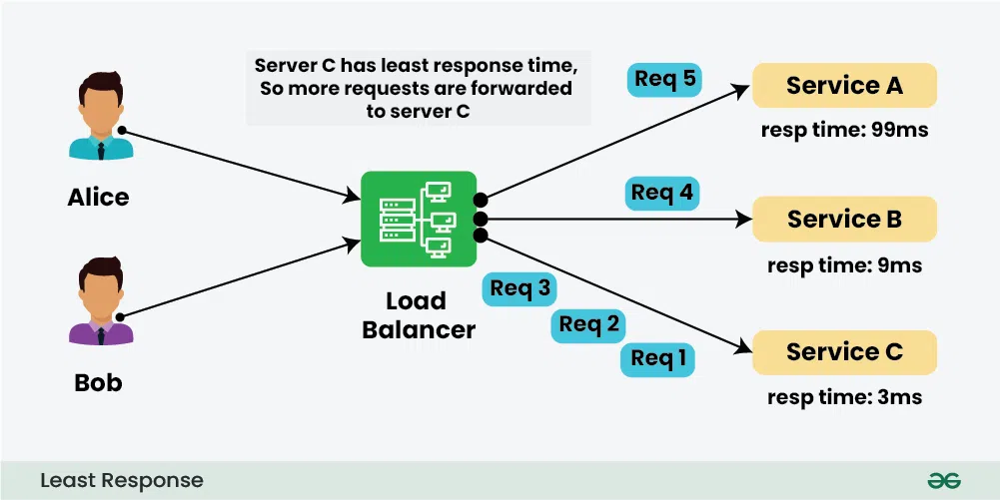
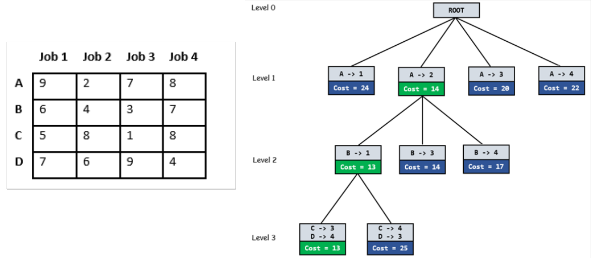
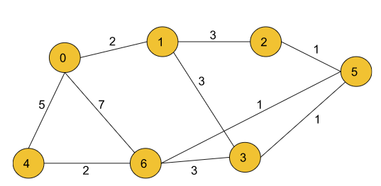
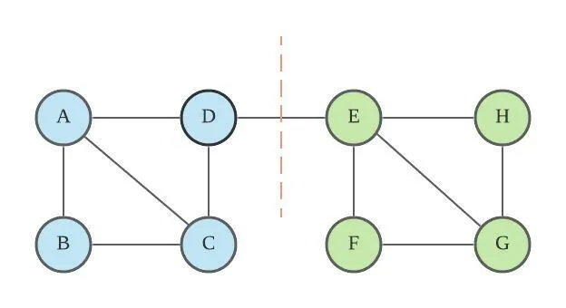

# Portfolio on Q-Commerce Applications: Exploring System Design, Principles, Data Structures, and Algorithms.

This is a project for the course Algorithmic Problem Solving, introduced by Mr. Prakash Hegade, School of Computer Science and Engineering (SOCSE), KLE Technological University, Hubli.

## Goals of the Portfolio

- Exploring Design principles used in robust sclable solutions.
- Explore and study Advanced data structures and algorithms employed in robust systems.
- Understand integration of these elements to optimize performance and ensure 
  reliability in Quick Commerce applications.
## Introduction to Q-Commerce

Getting products delivered within an hour of ordering was a far-fetched dream a few years ago. But this concept is now becoming part of our reality with companies like Blinkit, Swiggy Instamart, etc., introducing their own quick delivery services. This quick delivery has disrupted the existing market and created a new industry domain for itself – Q-Commerce. [1]

## How is it Different from E-Commerce?

Q-Commerce or quick commerce is an e-commerce business model driven by quick on-demand delivery; that is, the business tends to deliver the ordered items within an hour of placing the order.

The quick commerce business model combines the benefits of e-commerce (conducting trade using the internet) and the traditional shopping experience (completing trade within minutes) to create a new business model that satisfies the increasing demands for speed while buying online.

## Market Analysis

The Q-Commerce Industry In India Market size is estimated at USD 3.34 billion in 2024, and is expected to reach USD 9.95 billion by 2029, growing at a CAGR of greater than 4.5% during the forecast period (2024-2029).

In India, the quick commerce market is witnessing a significant growth rate because it provides consumers faster shopping experience than any other e-commerce platform. The reason for the increased adoption of quick commerce platforms is because of the fast and convenient delivery service. The rising urbanization and the trend of online shopping also contribute to the growth of the quick commerce industry in India.

Quick commerce is one of the fastest-growing e-commerce platforms that enhances convenience through the fast delivery of products. The factor that attracts customers to the instant delivery platform is the delivery of products to doorsteps within 10-30 minutes.

The Indian quick commerce market is competitive. Consumers are increasingly shifting toward quick commerce because of factors such as fast delivery, price, discounts & offers, wide product assortment, availability, and ease of payment. 

The major players in the market include Swiggy Instamart, Blinkit, Dunzo, Big Basket, and Zepto. These players hold more than 80% market share.
This portfolio focuses on high-level system design, data structures, and algorithms for the Blinkit application. [2]

## Objective

Design a high-level system architecture, identify, and discuss relevant data structures and algorithms used to create robust and scalable solutions.

## Scope of the Project
The project scope does not include payment processing, and our focus does not extend to low-level design or database schema.

### System Design

#### Functional Requirements

- Should provide a search functionality with delivery ETA.
- Should provide a catalog of all products.
- Should provide Cart and Wishlist features.
- Should handle order processing smoothly.
- Should provide a view for all previous orders.

#### Non-Functional Requirements

- **Scalability**
- **Availability**
- **Consistency**

Inventory is managed by a main NoSQL cluster that holds item details, with updates from vendors coming through Kafka. Various services may need to interact with vendors, collectively referred to as "Inbound Services."

The search service is crucial for efficient operation as it interacts with multiple services and data stores. It provides users with a list of items based on their search using full-text search, which can be implemented with Elastic Search or MongoDB's version. The search results are cached in Redis for quick retrieval later. We will also discuss the feature of search auto-complete in a later part of this portfolio.

The search service invokes the Serviceability and ETA service to determine if the user's location is serviceable. This service uses a database of users and delivery partners, utilizing their “latitude” and “longitude” for location-based filtering. These databases are partitioned based on cities, Google Maps provides reverse Geo-Coding API to identify current city & related location information based on current user coordinates for efficient filtering. Delivery partner locations are continuously updated through Kafka.

Users are also shown recommendations based on their cart, wishlist, and order history. The orders service caches orders in Redis and stores them in a MySQL database for ACID properties. Payment processing is handled by the "Payment" service, which returns the status of the payment. If successful, the transaction is updated in the MySQL database, a notification is sent to the user via Kafka, and necessary updates are made in the inventory database. The order is then archived in a NoSQL database instead of maintaining all orders in a MySQL cluster.

# Concepts Discussed in Q-Commerce Application Portfolio

This portfolio focuses on discussing various algorithms and data structures relevant to the Blinkit application.

## Concepts Covered

- **Indexing with B+ Trees**
- **Auto-complete suggestions for search with Trie**
- **Path finding with A\* Search**
- **Max Flow Problem**
- **Skip Lists**
- **Hash Tables**
- **Full text search - Inverted Indexing**
- **Range based queries - Segment Trees**
- **Load balancer - Least Response Time Algorithm**
- **Assignment Problem**
- **Dijkstra’s Algorithm**
- **Disjoint Set**
- **Girvan Newman Algorithm**
- **Hashmaps**
- **Content-based Filtering Algorithm**

## B+ Trees for Secondary Indexing

Indexing is a mechanism to improve the speed and reduce the number of operations for data retrieval from secondary storage.

### B-Trees and B+ Trees

B-trees are widely used in databases and file systems. They are specialized variants of m-way trees, which are balanced tree data structures that maintain sorted data and allow for efficient insertion, deletion, and search operations.

B+ trees are an extension of B-trees that improve upon certain aspects, particularly for database systems. In B+ trees, all record pointers are maintained in the leaf nodes, thereby forming a dense index at the leaf nodes. All the keys are present in the leaf nodes, and their copies may be present in the upper portions of the trees. B+ trees serve best for optimizing retrieval for queries from secondary storage. [3]
Here is my code: [click here](https://github.com/ud4yy/codes4port/blob/main/code/BpTree.cpp)

### Searching Efficiency

Searching for a record without indexing may require a full table scan, which is inefficient. With B+ trees, the search operation works with an efficiency of O(logn).

## Auto-complete Suggestions for Search – Trie

Trie data structures are efficient for implementing auto-complete suggestions in search functionalities.

### Mechanism of Auto-complete with Trie

The figure depicts the flow for auto-complete suggestion for search. T1 and T2 are TrieDBs that hold a serialized structure of Trie generated by the data collection component periodically. Various services may be involved in data collection. The data is in the form of “Phrase-Weight”.

The above figure illustrates the mechanism of deriving suggestions from the Trie. We maintain top-k terms with each node for a prefix, where k=2 in this example. During the creation of the Trie, we associate weights with each phrase during the data collection phase. When a request comes in for a prefix like “ba”, we return the top-2 terms "bath" and "bat".

### Complexity

Searching for a prefix in a Trie has a time complexity of O(p), where p is the length of the prefix. Retrieving the top-k terms for a prefix adds a constant time operation of O(k), making the overall complexity for retrieving suggestions O(p + k). [4]
Here is my code: [click here](https://github.com/ud4yy/codes4port/blob/main/code/Trie.cpp)

## A* Search for Path Finding

Finding the optimum path in an efficient way with fewer operations is crucial for applications where fast delivery is a key feature. The A* (A-star) search algorithm excels in such scenarios by combining the best aspects of Dijkstra's algorithm and heuristic methods to efficiently find the shortest path.

### Graphical Illustration: Comparing Dijkstra's Algorithm and A* Search

    <figure style="margin: 0 1%; text-align: center;">
        
        <figcaption>Dijkstra's Algorithm</figcaption>
    </figure>
    <figure style="margin: 0 1%; text-align: center;">
        
        <figcaption>A* Search Algorithm</figcaption>
    </figure>

The time complexity of A* depends on the quality of the heuristic function. In a worst-case, the algorithm can be O(b^d), where b is the branching factor – the average number of edges from each node, and d is the number of nodes on the resulting path. [5]
Here is my code: [click here](https://github.com/ud4yy/codes4port/blob/main/code/Astar.py)
## Max Flow Problem

As businesses scale and expand to other continents, consumers from different countries may abandon web pages due to slow load times. To optimize operations for users located globally, Content Delivery Networks (CDNs) are utilized.

The Max Flow Problem is a network flow problem that involves finding the maximum flow possible from a source node to a sink node in a flow network. This concept is highly applicable in optimizing data flow from a main server (source) to various CDNs (sinks) distributed globally.

We can use Ford-Fulkerson’s Algorithm to maximize the material flow in the network. We iteratively develop a residual graph based on which we obtain the augmented path “p”. We add the bottleneck(p) to the overall flow of the modified flow network and repeat this step until no more augmenting paths exist.

Time complexity of this algorithm is O(max_flow * E). We run a loop while there is an augmenting path. In the worst case, we may add 1 unit flow in every iteration, making the time complexity O(max_flow * E). [6]

Here is my code: [click here](https://github.com/ud4yy/codes4port/blob/main/code/MaxFlow.cpp)

## Data Structures that Power Redis

Redis is a high-performance, in-memory data structures server that enables efficient data storage and retrieval. It communicates over networks using the Redis protocol and employs several key data structures, primarily Skiplists and Hashtables, to power its key-value stores. Hashtables offer O(1) average time complexity for key-based operations, while Skiplists provide O(logn) average complexity for ordered operations. [7]
Here is my code: [click here](https://github.com/ud4yy/codes4port/blob/main/code/SkipList.cpp)

## Inverted Index - Indexing for Full-Text Search

Unlike traditional search methods that rely on exact word or phrase matches, a full-text search refers to a search of all of the documents' contents within the full-text queries’ range(s) that are relevant. This includes topic, phrasing, citation, or additional text attributes.

A full-text search index is a specialized data structure that enables the fast, efficient searching of large volumes of textual data. To create a full-text search index, each text field of the dataset is analyzed, cleaned, and processed, and finally, the dictionary is created. [8]

Inverted indexes are used to store the mapping between terms and the documents in which they are contained, enabling rapid lookups during searches to optimize the search process.
Here is my code: [click here](https://github.com/ud4yy/codes4port/blob/main/code/InvertedIndex.cpp)

### Access Time Complexity

The access time complexity to retrieve documents containing keywords from an inverted index is O(1).

## Range-based Filtering – Segment Trees
Segment Trees are efficient data structures for applying filters on retrieved database items. They support fast querying, point updates, and range updates with Lazy Propagation. Segment Trees excel in range queries, enabling operations like sum, minimum, maximum, and more over specific ranges of elements. [9]

This structure enables fast query and update operations with time complexity of O(logn)

Here is my code: [click here](https://github.com/ud4yy/codes4port/blob/main/code/segmentTree.cpp)

## Load Balancing Algorithm – Least Response Time

The Least Response Time algorithm optimizes server load balancing by directing new requests to servers with the quickest historical response times. It dynamically routes incoming requests based on server performance metrics, aiming to minimize response times. Adding or updating a server is efficient with an average time complexity of O(1), while finding the server with the Least Response Time in the worst-case scenario takes O(n).

Here is my code: [click here](https://github.com/ud4yy/codes4port/blob/main/code/LeastResponsetime.java)

## Top-k Items Sorted by Price - Heaps
Heaps are efficient data structures for managing priority-based operations such as sorting. They are particularly useful for scenarios like sorting search results by price. In a Min-Heap, the smallest element (lowest price) is always at the root, making it ideal for retrieving the top-k smallest prices efficiently. Conversely, a Max-Heap can efficiently retrieve the top-k largest prices. Heapifying an array of n elements takes O(n) time, enqueueing n elements in an empty heap takes O(n log n), and fetching the top-k elements takes O(k log n) time complexity. [10]

Here is my code: [click here](https://github.com/ud4yy/codes4port/blob/main/code/priority.cpp)

## Product Cataloging – Hashmaps
After fetching product items from a database, organizing them efficiently for presentation on a homepage can be achieved using hashmaps. Each hashmap key represents a category, with the corresponding value being a collection of products belonging to that category. Hashmaps provide average O(1) time complexity for retrieving products by category, ensuring efficient access and organization.

Here is my code: [click here](https://github.com/ud4yy/codes4port/blob/main/code/hashMap.cpp)

## Optimization for Content-Based Filtering for Recommendation
Content-based filtering is a crucial algorithm in recommendation systems, leveraging deep neural networks to predict user preferences for items based on learned features. To optimize this process, precomputing and storing ||V_u - V_m||^2 in hashmaps reduces runtime inference to O(1) time complexity. This optimization significantly enhances recommendation generation efficiency. [11]

Here is my code: [click here](https://github.com/ud4yy/codes4port/blob/main/code/OptimContentFiltering.py)

## Assigning Jobs to Workers – Assignment Problem
The assignment problem involves assigning jobs to workers to minimize total assignment costs. Using the Branch and Bound algorithm efficiently finds the optimal solution by exploring potential assignments in a prioritized manner, guided by cost estimates. This approach employs intelligent heuristics to prune less promising branches early, ensuring efficient search and solution discovery. [12]

Here is my code: [Assignment.cpp](https://github.com/ud4yy/codes4port/blob/main/code/Assignment.cpp)

This optimization strategy achieves a time complexity of O(M*N) where M is number of jobs and N is number of workers

## Number of ways to arrive to destination – Dijkstra
In the scenario where a delivery partner needs to determine the number of ways to arrive at a destination with the shortest path, we can use Dijksrta’s algorithm to solve this problem. [13]

The four ways to get there in 7 minutes (which is the shortest calculated time) are:
- 0  6
- 0  4  6
- 0  1  2  5  6
- 0  1  3  5  6

As we are using simple dijkstra’s algorithm the time complexity will be O(E*log(V)), where E is number of edges and V is number of Vertices.

Here is my code: [click here](https://github.com/ud4yy/codes4port/blob/main/code/Dij.cpp)
## Customer Segments – Dynamic Graph with Disjoint Set based on similarity
Based on the similarity measure (cosine similarity, hamming similarity) between the User’s data, we can formulate graph representing customer segments, and since the user’s data like preferences are not static, we can use Disjoint Set datastrcture to maintain this “Dynamic Graph”.
Utilizing a dynamic graph structure with Disjoint Set data structure enables scalable and efficient management of customer segments based on evolving user data, the basic operations of Disjoint set structure Union and Find takes O(alpha(n)) which is nearly constant O(1). [14]

Here is my code: [click here](https://github.com/ud4yy/codes4port/blob/main/code/DisjointSet.cpp)

## User community Detection with Girvan Newman Algorithm
Community detection in dynamic graphs is essential for understanding and analyzing complex networks where nodes and their relationships evolve over time. 

By identifying cohesive groups or communities within these networks, organizations can gain insights into interconnected user behaviors, preferences, and interactions. 
This algorithm removes edges with largest edge betweenness (Number of shortest paths passing from the edge) in every iteration. The time complexity of Girvan-Newman’s algorithm increases up to O(m*m*n) on a sparse graph having m edges and n nodes.

Here is my code: [click here](https://github.com/ud4yy/codes4port/blob/main/code/girVan.py)

### References

1. Mordor Intelligence Research & Advisory. (2024, June). *Quick Commerce Market in India Size & Share Analysis - Growth Trends & Forecasts (2024 - 2029)*. Mordor Intelligence. Retrieved July 9, 2024, from [Mordor Intelligence](https://www.mordorintelligence.com/industry-reports/q-commerce-industry-in-india).

2. Feed Dough. (2024, June). *Quick Commerce Business Model (2024)*. Feed Dough. Retrieved July 9, 2024, from [Feed Dough](https://www.feedough.com/q-commerce-quick-commerce-business-model/).

3. Jensen, C. S., Lin, D., & Ooi, B. C. (2004, August). Query and update efficient B+-tree based indexing of moving objects. In *Proceedings of the Thirtieth international conference on Very large data bases-Volume 30* (pp. 768-779).

4. Connelly, R. H., & Morris, F. L. (1995). A generalization of the trie data structure. *Mathematical structures in computer science, 5*(3), 381-418.

5. Candra, A., Budiman, M. A., & Pohan, R. I. (2021, June). Application of a-star algorithm on pathfinding game. In *Journal of Physics: Conference Series* (Vol. 1898, No. 1, p. 012047). IOP Publishing.

6. Kyi, M. T., & Naing, L. L. (2018). Application of Ford-Fulkerson algorithm to maximum flow in water distribution pipeline network. *International Journal of Scientific and Research Publications, 8*(12), 306-310.

7. Pugh, W. (1990). Skip lists: a probabilistic alternative to balanced trees. *Communications of the ACM, 33*(6), 668-676.

8. Rae, I., Halverson, A., & Naughton, J. F. (2014, March). In-rdbms inverted indexes revisited. In *2014 IEEE 30th International Conference on Data Engineering* (pp. 352-363). IEEE.

9. Chang, Y. K., & Lin, Y. C. (2007). Dynamic segment trees for ranges and prefixes. *IEEE Transactions on Computers, 56*(6), 769-784.

10. Cherkassky, B. V., Goldberg, A. V., & Silverstein, C. (1999). Buckets, heaps, lists, and monotone priority queues. *SIAM Journal on Computing, 28*(4), 1326-1346.

11. Tam, D., Azimi, R., & Jacobsen, H. A. (2003, September). Building content-based publish/subscribe systems with distributed hash tables. In *International Workshop on Databases, Information Systems, and Peer-to-Peer Computing* (pp. 138-152). Berlin, Heidelberg: Springer Berlin Heidelberg.

12. Hahn, P., Grant, T., & Hall, N. (1998). A branch-and-bound algorithm for the quadratic assignment problem based on the Hungarian method. *European Journal of Operational Research, 108*(3), 629-640.

13. Johnson, D. B. (1973). A note on Dijkstra's shortest path algorithm. *Journal of the ACM (JACM), 20*(3), 385-389.

14. Galil, Z., & Italiano, G. F. (1991). Data structures and algorithms for disjoint set union problems. *ACM Computing Surveys (CSUR), 23*(3), 319-344.

15. Despalatović, L., Vojković, T., & Vukicević, D. (2014, May). Community structure in networks: Girvan-Newman algorithm improvement. In *2014 37th international convention on information and communication technology, electronics and microelectronics (MIPRO)* (pp. 997-1002). IEEE.

